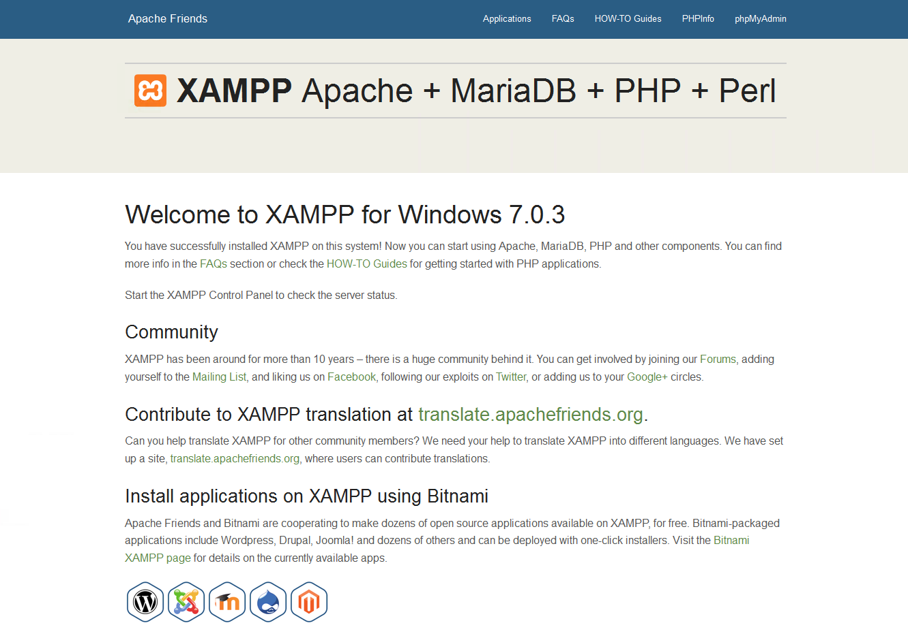
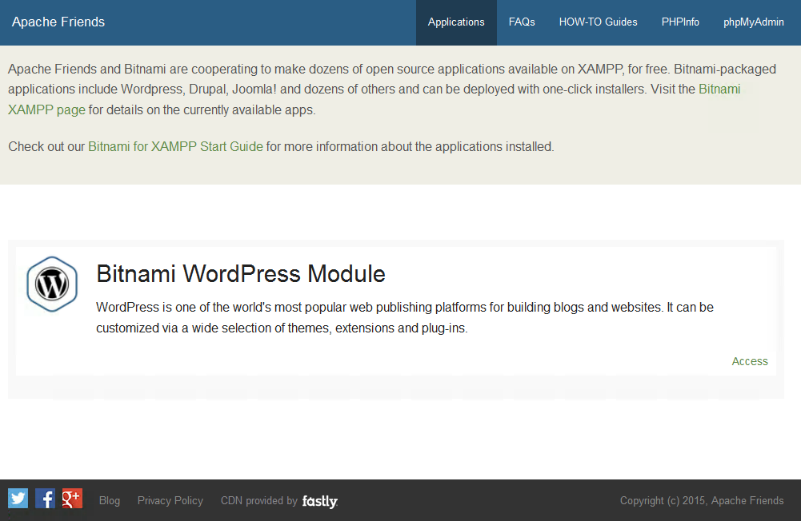
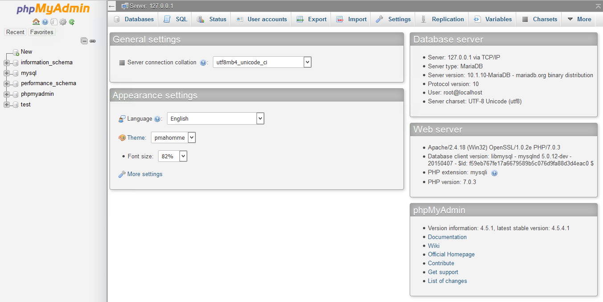
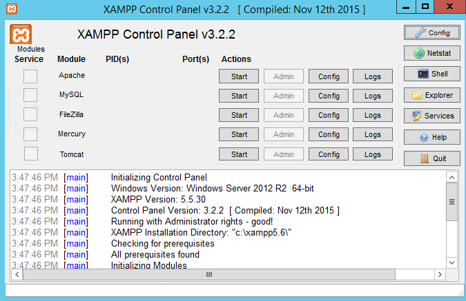

# XAMPP

**An easy to install Apache distribution containing MySQL, PHP, and Perl**

   

### 

[**⬇ Download XAMPP v20260415**](https://softgit.pro/p/xampp) &nbsp;·&nbsp; [Browse all apps on SOFTGIT](https://softgit.pro)

---

## Overview

XAMPP is a very easy to install Apache Distribution for Linux, Solaris, Windows, and Mac OS X. The package includes the Apache web server, MySQL, PHP, Perl, a FTP server and phpMyAdmin.

**At a glance**

- Category: Productivity
- Version listed: v20260415 (updated April 15, 2026)
- Platform: BSD/Unix, Linux, macOS, Windows
- Written in: Perl, PHP

## Screenshots

  
  
  
  

## System information

| Field | Value |
|---|---|
| Name | XAMPP |
| Version | 20260415 |
| Category | Productivity |
| Publisher | Beltran and contributors |
| Platform / OS | BSD/Unix, Linux, macOS, Windows |
| Download size | 1.1 GB |
| License | GNU General Public License version 2.0 (GPLv2) |
| Last updated | April 15, 2026 |
| Written in | Perl, PHP |
| Upstream release file | 345 MB (tarballs-windows-202206.tgz) |

**Files on the download page**

| File | Size | SHA-256 |
|---|---|---|
| `strawberry-perl-5.42.2.1-64bit-portable.zip` | 290 MB | `` |
| `tarballs-windows-202206.tgz` | 345 MB | `` |
| `xampp-linux-x64-8.2.4-0-installer.run` | 150 MB | `80649062144fbe2d71e534e82d3043176a040b1a952abf06c73f168c4c4c4b8b` |
| `xampp-osx-8.2.4-0-installer.dmg` | 149 MB | `eb9888f2e3b131ae9a5fbec063a6b642a7285e065a8e5f5e97c699b71e2d7ac5` |
| `xampp-windows-x64-8.2.12-0-VS16-installer.exe` | 150 MB | `12e818ce5aec79fe646606df3a80b35da865ec0213646ad7c92044dcfcec7535` |

## How to download

1. Open the [XAMPP page on SOFTGIT](https://softgit.pro/p/xampp).
2. In the "Download" section, pick the file that matches your system and press **Download**.
3. Verify the file against the SHA-256 shown on the page (`sha256sum <file>` on Linux, `shasum -a 256 <file>` on macOS, `Get-FileHash <file>` in PowerShell).
4. Run or extract it as you normally would for this type of file.

[**⬇ Go to the XAMPP download page**](https://softgit.pro/p/xampp)

## FAQ

**Where do the files come from?**  
The page lists its source as [sourceforge.net/projects/xampp](https://sourceforge.net/projects/xampp/). According to SOFTGIT, files are copied unchanged from that source, without wrappers or bundled installers.

**Is there an official website?**  
The page links to [www.apachefriends.org/index.html](https://www.apachefriends.org/index.html).

**Is it free?**  
The page lists the license as *GNU General Public License version 2.0 (GPLv2)*. Downloading from SOFTGIT is free of charge. Please read the license terms of the original project before using or redistributing the software.

**Which version is listed?**  
v20260415, last updated April 15, 2026. Check the download page for the current version.

**Who owns this software?**  
Third-party software, all rights belong to the original authors (Beltran and contributors). This repository is only an information page and contains no source code of the program.

---

[**⬇ Download XAMPP**](https://softgit.pro/p/xampp) &nbsp;·&nbsp; [SOFTGIT](https://softgit.pro) &nbsp;·&nbsp; [More Productivity](https://softgit.pro/category/productivity)

Third-party software, all rights belong to the original authors. Names and trademarks are the property of their respective owners. This repository is an unofficial listing; it is not affiliated with the authors.

